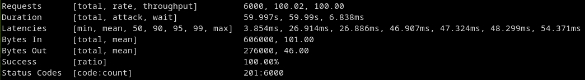

# Project structure

- **Raft library** (`/pkg/raft`)
- **URL shortener service** (`/internal/urlShortener`)
  - **HTTP server** (`/internal/urlShortener/server.go`)
  - **Finite-state machine** (`/internal/urlShortener/store.go`)
- **Main executable** (`/cmd/joinNode/main.go`)

---

# Load distribution

- only leader accepts write requests

```go
// 409 Conflict
type FoundLeader struct {
	Message  string `json:"message"`
	LeaderId int    `json:"leaderId"`
}
```

- every replica can answer read requests

---

# Expected Latency

- for a read request?
- for a write request?

---

# Expected Latency

<style scoped>
li {
  font-size: 24pt;
}
</style>

- `E[r] = processingTime + networkRoundtrip`
- `E[w] = (heartbeatInterval + networkRoundtripQuorum) / 2 + networkRoundtrip`

---

# Measured Latency

<style scoped>
img {
  width: 100%
}
p {
  font-size: 20pt
}
</style>


---

# Measured Latency

<style scoped>
img {
  width: 100%
}
</style>




---

# How tf did I debug this?

<style scoped>
img {
  width: 30%
}
</style>


---

# Questions?
